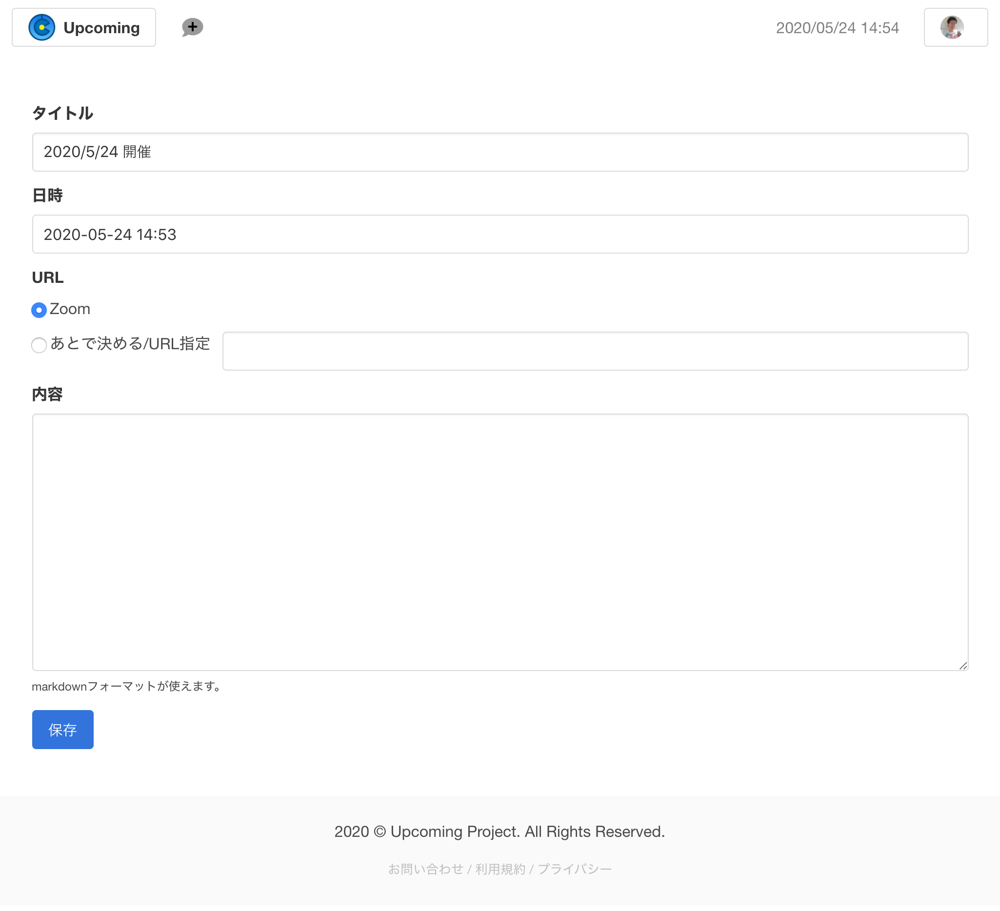

# How to use `Upcoming`

# Sign up (install)

To use the Upcoming site, you need a Zoom account or Facebook account.

## Visit the website and sign up

If you visit https://upcoming.to/, you'll see links to "Sign in using Zoom" and "Sign in using Facebook."

### Sign up (install) with Zoom

To use the service with Zoom, do the following:

1. Press the "Sign in using Zoom" button.
     You will be redirected to the Zoom site.
2. Sign in to Zoom (optional)
      If you are not signed in to the Zoom site, the sign-in screen will be displayed. Enter the information and sign in.
3. Allow application usage

      Upcoming allows you to receive information from Zoom to manage Zoom meetings and to display the user's profile. To accept this condition, click the "Authorize" button. If you do not accept this condition, please click "Reject".
4. Sign-up (installation) is now complete!
    
     If the screen displays "Zoom account authentication succeeded.", You are done.

### Sign up (install) using Facebook

To use the service using Facebook, do the following.

1. Press the "Sign in using Facebook" button. -> Switch to the Facebook site.
2. Sign in to Facebook (optional) -> If you are not signed in to the Facebook site, the sign-in screen will appear, enter your information and sign in.
3. Allow application usage

    Upcoming receives the information from Facebook to display the user's profile. (We will not write information to Facebook.) If you accept this condition, please press the blue button in the center of the screen. If you do not accept this condition, please click "Cancel".
4. Sign-up (installation) is now complete!

    If the screen displays "Successful authentication with your facebook account", you are done.

# How to use

Upcoming has three major functions.

* Set up a meeting
* Join a meeting
* Stay in touch with the meeting

## Set up a meeting

To create a meeting, click on the "mark with a + in the balloon" at the top left of the screen. Or, if you're just signed up, you'll see a link that says "New Meeting". Click it. This will open a screen where you can create a new meeting.

This screen allows you to enter a meeting title, date and time, and content. Although it is a part called "URL", if you sign up with Zoom, the option "Zoom" will be displayed. If you select this, the Zoom meeting URL will be created automatically. If you select "Determine later / Specify URL", you can enter the URL of the meeting in the text box on the right, or you can decide the URL later without entering anything. Meeting URLs that can be entered in the text box on the right include Zoom, Google Meet, Whereby, MS Teams, Facebook Rooms.

Click the save button to complete the creation. After that, the meeting you created will be displayed.

## Invite to a meeting

You can find the URL at the top of the meeting screen. This URL will be different for each meeting. Give this URL to the people who will attend the meeting so that they can see the meeting information.

## Join the meeting

If someone tells you the URL for your meeting, you can visit the meeting page and view information by visiting that URL.
However, if you have never signed up (installed) before, you will need to authenticate with Zoom or Facebook. The procedure for authentication is the same as the procedure described in Signup (installation), but after signing up, the meeting page is displayed.

## Stay in touch with the meeting

On the meeting page, you can write a comment from the right column. This allows you to write down any questions you may have about the meeting, or tell them if you are late for your appointment.

## Other

Upcoming has some other features as well.

### Attach files to meetings

You can send the file you have at the place of "Add file +" on the meeting page. If the sent file is an image, a thumbnail will be displayed. For each file, the file name, the date and time it was sent, and who sent it are displayed.

### Check the list of meetings

After signing up, you will be able to see the upcoming meetings on the top page of the site.

# Uninstall

If you want to stop using the services such as Zoom and Facebook that you used to sign up, perform the uninstall operation on each service.

## Uninstall Zoom

1. Log in to your Zoom account and go to the Zoom App Marketplace. https://marketplace.zoom.us/
2. Press the Manage button, select Installed Apps and search for Upcoming apps.
3. Click the app's Uninstall button.

    This operation will delete your Zoom account information from the Upcoming service. Information about usage (created meetings, comments, uploaded files, etc.) will be handled differently depending on whether there is integration with other services. See * 1 for details.

## Uninstall Facebook

1. Login to your Facebook account, go to Settings & Privacy and select "Apps & Websites".
2. Open the Active tab (selected by default) and search for the `Upcoming` app.
3. Click "Check / Edit" on the right side of the app.
4. Click the "Delete" button displayed to the right of Delete this app at the bottom of the popup.

    This will remove your Facebook account information from the Upcoming service. Information about usage (created meetings, comments, uploaded files, etc.) will be handled differently depending on whether there is integration with other services. See * 1 for details.

----------

## * 1 About deleting user information after deleting the account

If you are working with a service other than the one you are uninstalling, your usage information (meetings created, comments, files uploaded, etc.) will remain. If there is no linkage with other services, information about usage will be deleted immediately after canceling the linkage.

# Contact

If you have any problems with using Upcoming, please feel free to contact us using the contact form below.

https://upcoming.to/contact
