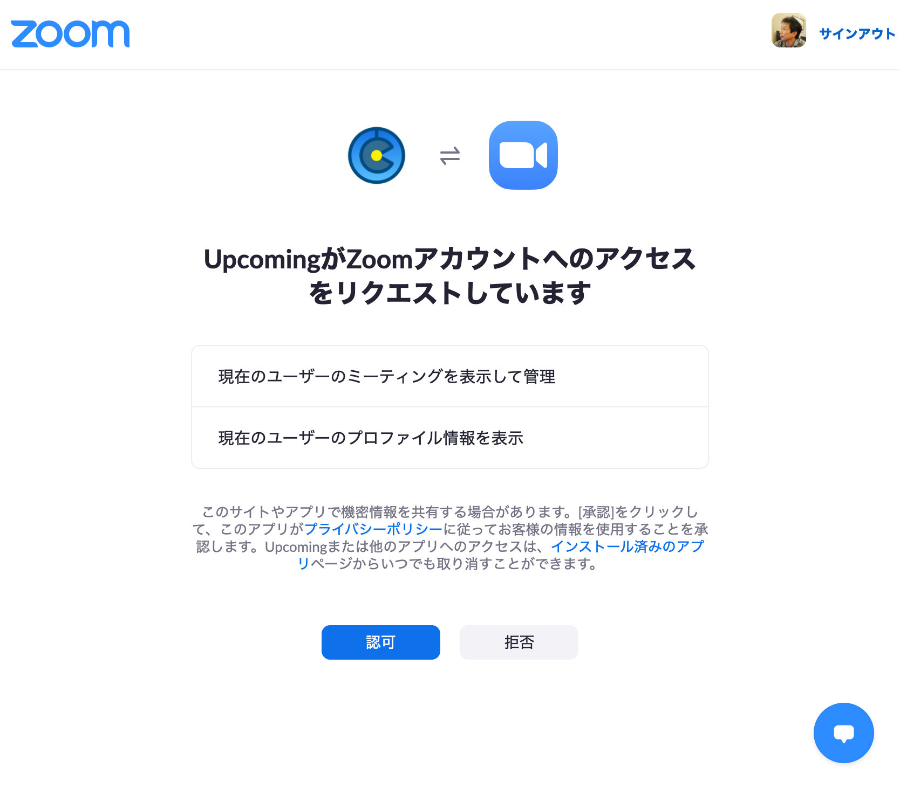
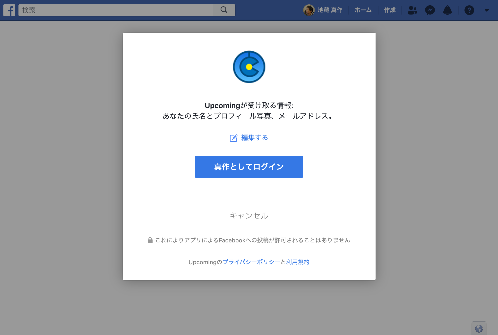
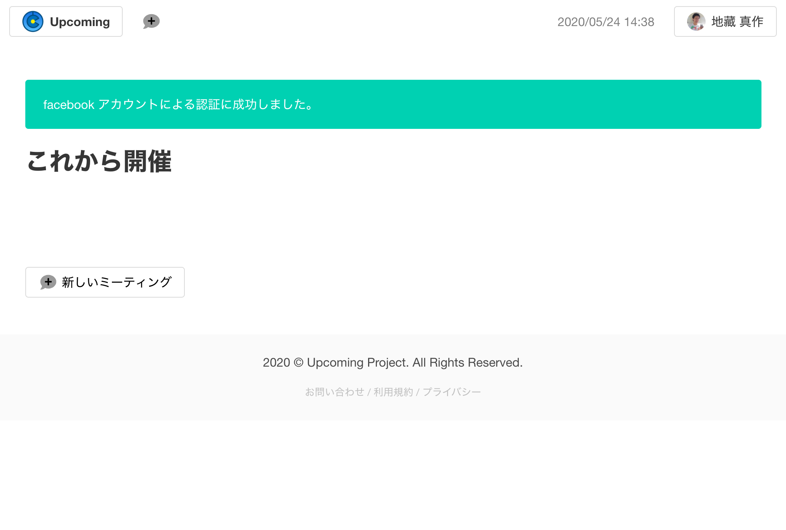
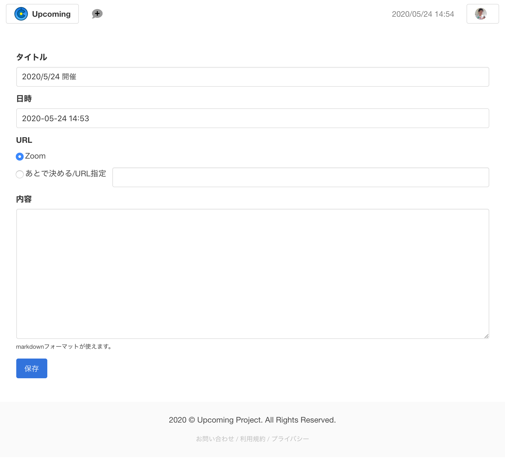
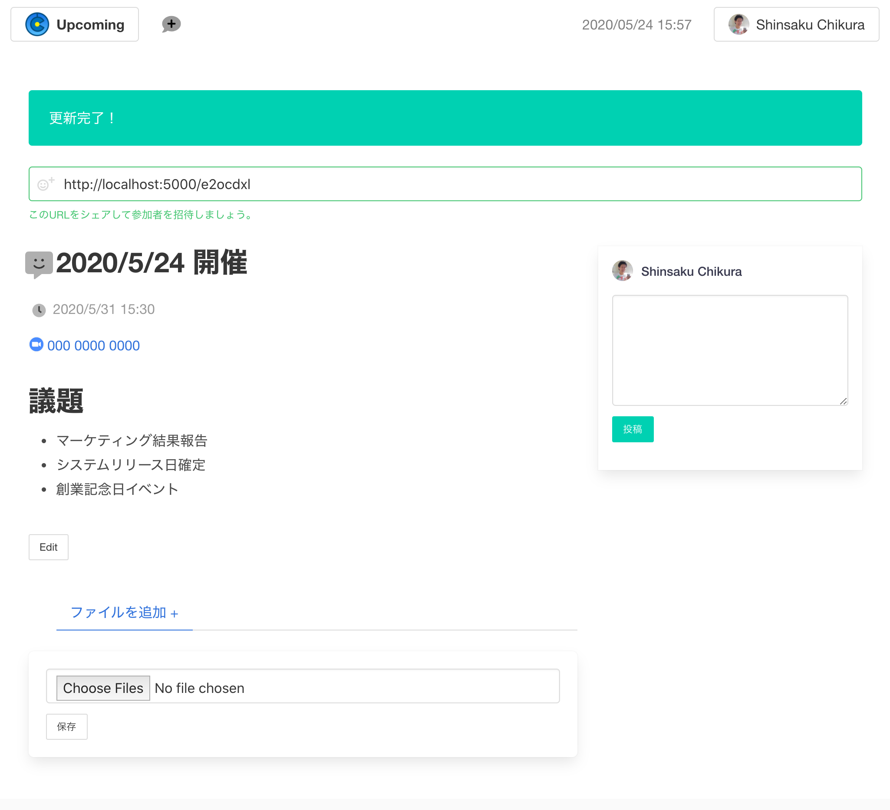
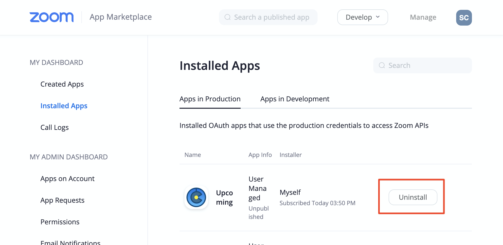

# `Upcoming` の使い方

# サインアップ(インストール)

Upcomingサイトを利用するには、Zoomアカウント、またはFacebookアカウントが必要です。

## Webサイトにアクセスしてサインアップする

https://upcoming.to/ にアクセスすると、「Sign in using Zoom」と「Sign in using Facebook」というリンクがあります。

### Zoomを使ってサインアップ(インストール)する

Zoomを使ってサービスを利用する場合は、下記の操作を行います。

1. 「Sign in using Zoom」のボタンを押す。-> Zoomのサイトに遷移します。
2. Zoomにサインインする(オプション) -> もしZoomのサイトにサインインしていない場合は、サインイン画面が表示されますので、情報を入力してサインインします。
3. アプリケーションの利用を許可する

      Upcomingでは、Zoomのミーティングを管理するため、また、ユーザのプロフィールを表示させるため、それぞれの情報をZoomから受け取れるようにします。この条件を許諾される場合は「認可」ボタンを押してください。もし、この条件を許諾されない場合は、「拒否」を押してください。
4. これでサインアップ(インストール)は完了です！
    
     画面に「zoom アカウントによる認証に成功しました。」と表示されれば完了です。

### Facebookを使ってサインアップ(インストール)する

Facebookを使ってサービスを利用する場合は、下記の操作を行います。

1. 「Sign in using Facebook」のボタンを押す。 -> Facebookのサイトに遷移します。
2. Facebookにサインインする(オプション) -> もしFacebookのサイトにサインインしていない場合は、サインイン画面が表示されますので、情報を入力してサインインします。
3. アプリケーションの利用を許可する

    Upcomingではユーザのプロフィールを表示させるため、その情報をFacebookから受け取ります。(Facebookに情報を書き込んだりすることはありません。)この条件を許諾される場合は画面中央部にある青いボタンを押してください。もし、この条件を許諾されない場合は、「キャンセル」を押してください。
4. これでサインアップ(インストール)は完了です！

    画面に「facebookアカウントによる認証に成功しました」と表示されれば完了です。

# 使い方

Upcomingには大きく3つの機能があります。

- ミーティングを設定する
- ミーティングに参加する
- ミーティングの連絡を取り合う

## ミーティングを設定する

ミーティングを作るには、画面の左上にある「吹き出しに＋が付いたマーク」をクリックします。または、サインアップ直後であれば、「新しいミーティング」というリンクが表示されますので、それをクリックします。すると、新しいミーティングを作る画面が開きます。

この画面では、ミーティングのタイトル、日時、内容を入力できます。「URL」という部分ですが、Zoomでサインアップをした場合には、Zoomという選択肢が表示されます。これを選択すると、ZoomのミーティングURLが自動的に作られます。「後で決める/URL指定」を選択すると、右側のテキストボックスにミーティングのURLを入力するか、そのまま何も入力せずに、後からURLを決めることができます。右側のテキストボックスに入力可能なミーティングのURLは、Zoom, Google Meet, Whereby, MS Teams, Facebook Roomsなどがあります。

保存ボタンを押すと、作成は完了です。その後、作成したミーティングが表示されます。

## ミーティングに招待する

ミーティングの画面の上部には、URLが記載されています。このURLはミーティングごとに異なります。ミーティングに参加する人にこのURLを伝えることで、その人がミーティングの情報を見ることができるようになります。

## ミーティングに参加する

他の方からミーティングのURLを伝えられた場合、そのURLにアクセスするとミーティングのページにアクセスし、情報を見ることができます。
ただし、今までに一度もサインアップ(インストール)をしたことがない場合、ZoomまたはFacebookでの認証が必要になります。認証の手順については、サインアップ(インストール)に記載した手順と同じですが、サインアップ後は、ミーティングのページが表示されます。

## ミーティングの連絡を取り合う

ミーティングのページでは、右側の欄からコメントを書くことができます。これにより、ミーティングについての質問があればそれを書き込んだり、予定に遅れそうであれば伝える、といったことができます。

## その他

Upcomingでは、それ以外にもいくつかの機能を用意しています。

### ミーティングにファイルを添付する

ミーティングのページで「ファイルを追加する＋」というところで手元にあるファイルを送信することができます。送信したファイルが画像であった場合、サムネールが表示されます。また、どのファイルについても、ファイル名や送信した日時、誰が送信したかが表示されます。

### ミーティングの一覧を確認する

サインアップ後、サイトのトップページには、これから行うミーティングが表示されるようになります。

# アンインストール

サインアップに利用したZoomやFacebookといったサービスの利用をやめる場合、それぞれのサービス上でアンインストール操作を行います。

## Zoomのアンインストール

1. Zoomアカウントにログインし、Zoom App Marketplaceに移動します。 https://marketplace.zoom.us/
2. Manageボタンを押し、Installed Appsを選択し、Upcomingアプリを検索します。
3. アプリのUninstallボタンをクリックします。

    この操作により、UpcomingサービスからZoomアカウントの情報が削除されます。利用に関する情報(作成したミーティング、コメント、アップロードしたファイルなど)については、他のサービスでの連携があるかどうかにより扱いが異なります。詳細は*1をご覧ください。

## Facebookのアンインストール

1. Facebookアカウントにログインし、設定とプライバシーから、「アプリとウェブサイト」を選択します。
2. 「アクティブ」タブ(デフォルトで選択されています)を開き、`Upcoming` アプリを検索します。
3. アプリの右側にある「確認・編集」をクリックします。
4. ポップアップ最下部のこのアプリを削除の右側に表示されている「削除」ボタンを押します。

    この操作により、UpcomingサービスからFacebookアカウントの情報が削除されます。利用に関する情報(作成したミーティング、コメント、アップロードしたファイルなど)については、他のサービスでの連携があるかどうかにより扱いが異なります。詳細は*1をご覧ください。

----------

## *1 アカウント削除後のユーザ情報削除について

利用される方が、アンインストールするサービス以外のサービスと連携している場合は、利用に関する情報(作成したミーティング、コメント、アップロードしたファイルなど)は引き続き残ります。もし、他サービスとの連携がない場合、利用に関する情報は連携を解除したあとすぐに削除されます。

# お問い合わせ先

Upcomingの利用に関して何か困ったことがあったら、いつでも下記のお問い合わせフォームからコンタクトをとってください。

https://upcoming.to/contact
